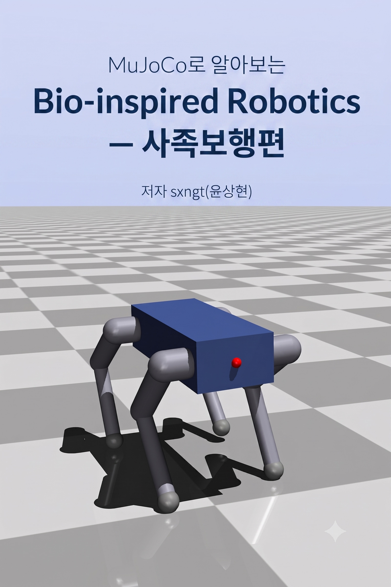
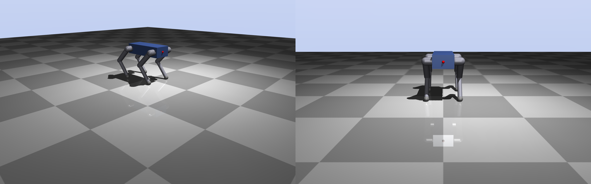
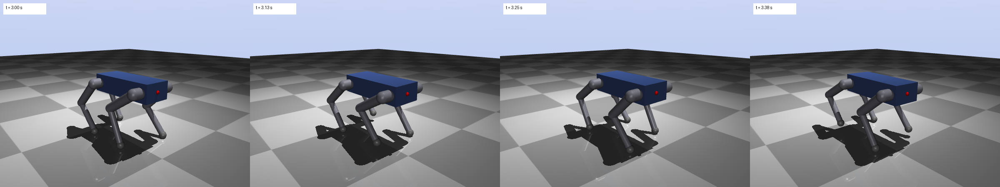
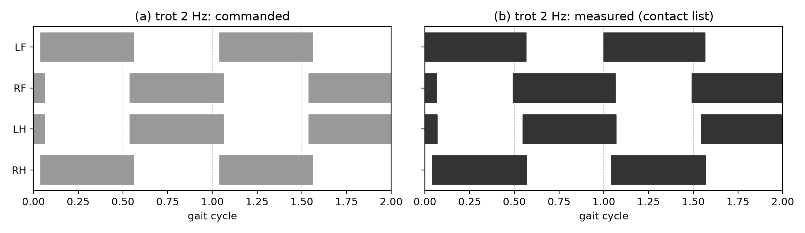
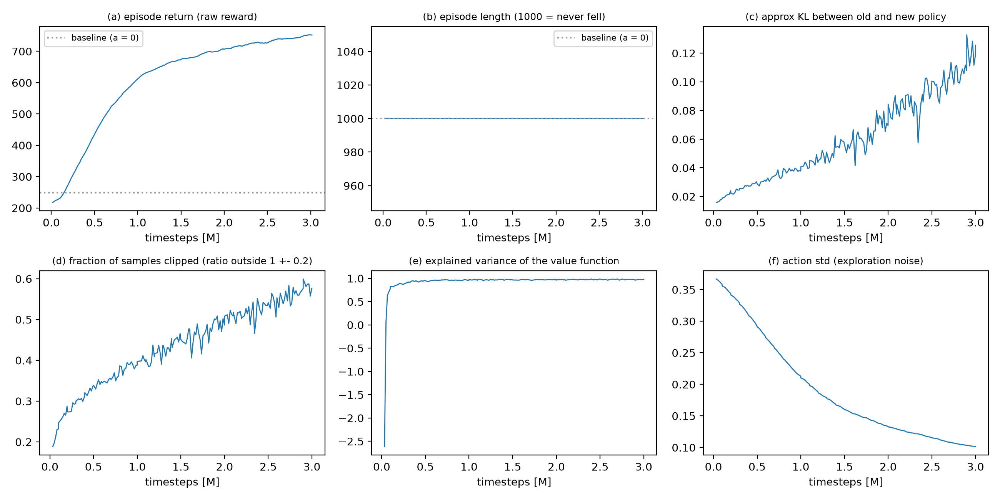
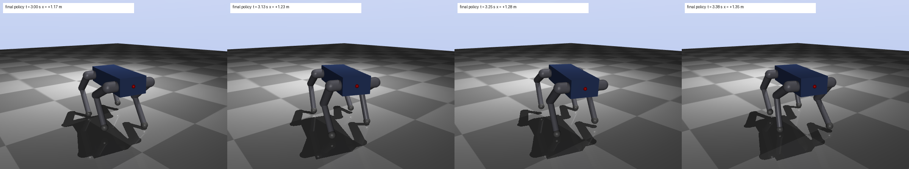
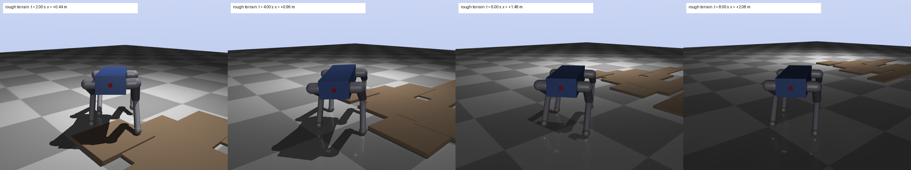

<p align="center">
  
</p>

<h1 align="center">Bio-Inspired Robotics with MuJoCo: Quadruped Locomotion<br/>Lab Code</h1>

<p align="center">
  <a href="#quick-start">Quick start</a> ·
  <a href="#chapter-by-chapter-labs">Chapter labs</a> ·
  <a href="#pretrained-policies-are-included">Pretrained policies</a> ·
  <a href="#when-something-breaks">Troubleshooting</a> ·
  <a href="https://github.com/sxngt/mujoco-bio-inspired-robotics-kr">한국어판 저장소</a>
</p>

<p align="center">
  
  
  
  
  <a href="LICENSE"></a>
</p>

This repository holds the lab code for the book **Bio-Inspired Robotics with MuJoCo: Quadruped Locomotion** by Sanghyun Yoon (sxngt). Every piece of code and every figure in the book was run and verified from this repository, and each section of the book pairs with one script here. The book is the English edition of 《MuJoCo로 알아보는 Bio-inspired Robotics: 사족보행편》, which is published on [WikiDocs](https://wikidocs.net/book/21135); the Korean lab repository is [mujoco-bio-inspired-robotics-kr](https://github.com/sxngt/mujoco-bio-inspired-robotics-kr).

## What you will build

Written for students and engineers entering legged robotics, the book follows one quadruped robot all the way through: **build it, make it walk, measure the gait, and correct the gait with reinforcement learning**, all inside the simulator. Every lab runs on a laptop CPU; no GPU is needed.

| Build | Walk | Measure | Learn |
|---|---|---|---|
|  |  |  |  |
| Chapter 5. Design a 12-joint quadruped in MJCF, then drop it and push it to validate it | Chapter 7. Build trot and walk by hand with coupled phase oscillators (CPG) | Chapter 8. Log foot contacts and compare with animals via duty factor, phase, and Froude number | Chapter 11. Gymnasium environment plus Stable Baselines3 PPO to correct the gait (residual learning) |

<p align="center">
  <br/>
  <sub>The final policy of Chapter 12: walks straight at 0.49 m/s and survives a 50 N push 100% of the time. The journey starts from the hand-coded gait of Chapter 7 (0.29 m/s, falls at 60 N).</sub>
</p>

The book does not hide failures. It pushes the hand-coded gait until it falls to show why open-loop control is stiff (Section 7.6), keeps a museum of the strange gaits that badly designed rewards produce (Section 12.3, reward hacking), and reports the final policy's loss of heading on slopes as it is (Section 13.3).

## Structure of the book

| Part | Chapters | Content | Code |
|---|---|---|---|
| Opening | 1 | Before Learning to Walk: Fundamentals in the Age of AI | none |
| 1 Understanding | 2, 3 | The Lens of Bio-Inspired Robotics / The Language of Gait (stance and swing, duty factor, phase, support polygon, gait diagram) | none |
| 2 Tools | 4, 5 | First Steps with MuJoCo (MjModel and MjData, timestep, contact) / Building My Own Quadruped in MJCF | `ch04`, `ch05` |
| 3 Implementation | 6, 7, 8 | Standing (PD control, gain tuning) / The First Gait (CPG, trot, walk, the limits of open-loop) / Hands-on gait analysis | `ch06`, `ch07`, `ch08` |
| 4 Learning | 9 to 12 | Reinforcement learning as a correction tool / The Gymnasium environment / Training with SB3 PPO / Reward shaping and curriculum | `ch09`, `ch10`, `ch11`, `ch12` |
| 5 Extension | 13 | Rough terrain and disturbances, MJX parallelism, sim-to-real | `ch13` |
| Appendices | A to D | 25 troubleshooting entries / MJCF reference / Glossary / Roadmap of papers and open source | |

## Quick start

All you need is [uv](https://docs.astral.sh/uv/). It installs Python 3.12 and the virtual environment for you. macOS, Linux, and Windows all work.

```bash
git clone https://github.com/sxngt/mujoco-bio-inspired-robotics.git
cd mujoco-bio-inspired-robotics

uv sync                 # Chapters 4 to 8: mujoco, numpy, matplotlib, gymnasium
uv sync --extra rl      # Chapters 10 to 12: + stable-baselines3, torch, tensorboard
uv sync --extra mjx     # Chapter 13: + mujoco-mjx, jax (optional)

uv run python ch04-mujoco-first-steps/01_hello_mujoco.py   # first lab: drop a box
uv run python ch07-first-gait/03_trot.py                   # the robot walks for the first time (figures go to out/)
```

| Item | Version | Note |
|---|---|---|
| Python | 3.12 | pinned by `.python-version` |
| MuJoCo | 3.12.0 | the `mujoco` Python package (viewer included) |
| Gymnasium | 1.3 or later | from Chapter 10 |
| Stable Baselines3 / PyTorch | 2.9+ / 2.8+ | `rl` extra, from Chapter 11 |
| MuJoCo MJX + JAX | 3.12.0 / 0.11+ | `mjx` extra, Chapter 13 only |

### Watch the scene yourself: `--view`

Every script saves its figures to `out/` and exits. To watch the same scene as the book's figure **in a viewer window in real time**, add `--view`. Real physics looks faster than you expect (a 1 m drop takes 0.45 s), so `--speed 0.5` (half speed) is the recommended setting while studying. Slowing the playback does not change the physics.

```bash
uv run python   ch07-first-gait/03_trot.py --view --speed 0.5    # Linux, Windows
uv run mjpython ch07-first-gait/03_trot.py --view --speed 0.5    # macOS needs mjpython only when a window opens
```

Drag with the mouse to rotate the view; hold Ctrl (Cmd on macOS) and drag to grab and push the robot.

### Pretrained policies are included

If you want to skip the training runs of Chapters 11 to 13 (3M steps in about 8 minutes, the Chapter 12 curriculum of 9M steps in about 20 minutes on a CPU), use the artifacts already in each chapter's `out/`. Later chapters read the results of earlier ones.

| File | Content |
|---|---|
| `ch11-sb3-training/out/ppo_first.zip` + `_vecnormalize.pkl` | the first PPO policy (0.84 m/s, but a 40 degree yaw drift) |
| `ch12-reward-shaping/out/R1_*.zip` to `R4_full.zip` | the controlled experiments that add one reward term at a time |
| `ch12-reward-shaping/out/H1_*.zip` to `H4_*.zip` | the reward hacking museum (deliberately broken rewards) |
| `ch12-reward-shaping/out/C_curriculum_6M.zip` | **the final policy** (push curriculum 20 to 60 N) |
| `ch13-wider-world/out/A_*.zip`, `B_*.zip` | no linear velocity observation, residual only, open generator |
| `ch08-gait-analysis/out/logs.npz` | the Chapter 8 contact logs (read by scripts 02 to 05) |

`*.zip` is the SB3 model and the matching `*_vecnormalize.pkl` holds the observation and reward normalization statistics. Always load them together (`load_trained` in `ch11-sb3-training/common.py`).

## Chapter-by-chapter labs

Each chapter folder has a `README.md` that maps its scripts to the book's sections. Script numbers follow the order of appearance in the text.

| Folder | Chapter | Scripts | Shared code created here |
|---|---|---|---|
| [`ch04-mujoco-first-steps`](ch04-mujoco-first-steps) | 4 First Steps with MuJoCo | 01 drop · 02 viewer · 03 MjModel/MjData · 04 timestep and contact · 05 control from Python · 06 offscreen rendering | |
| [`ch05-mjcf-modeling`](ch05-mjcf-modeling) | 5 MJCF modeling | 01 torso · 02 one leg · 03 inspect the robot · 04 sensors · 05 validation (drop, push) | `models/quadruped.xml`, `quadbook/robot.py` |
| [`ch06-standing-control`](ch06-standing-control) | 6 Standing | 01 torque vs position control · 02 PD intuition · 03 gain tuning · 04 resisting disturbances | `quadbook/control.py` |
| [`ch07-first-gait`](ch07-first-gait) | 7 The first gait | 01 foot trajectory · 02 CPG · 03 trot · 04 walk · 05 parameter sweep · 06 limits of open-loop | `quadbook/cpg.py`, `quadbook/sim.py` |
| [`ch08-gait-analysis`](ch08-gait-analysis) | 8 Gait analysis | 01 contact logging · 02 gait diagram · 03 metrics · 04 compare with animals · 05 anatomy of a fall | `quadbook/analysis.py` |
| [`ch09-rl-refinement`](ch09-rl-refinement) | 9 Reinforcement learning | 01 how far does a random policy walk before training (side experiment) | |
| [`ch10-gym-environment`](ch10-gym-environment) | 10 The environment | 01 interface · 02 observation · 03 action · 04 reward · 05 termination and reset | `quadbook/env.py` (`QuadBook/Quadruped-v0`) |
| [`ch11-sb3-training`](ch11-sb3-training) | 11 PPO training | 01 setup · 02 VecEnv/VecNormalize · 03 first training · 04 training curves · 05 before vs after | `common.py` |
| [`ch12-reward-shaping`](ch12-reward-shaping) | 12 Reward shaping | 00 train everything · 01 controlled experiments · 02 the terms · 03 reward hacking · 04 curriculum · 05 final analysis | `train_lib.py` |
| [`ch13-wider-world`](ch13-wider-world) | 13 The wider world | 00 training · 01 robustness · 02 MJX benchmark · 03 sim-to-real gaps · 04 open generator · 05 anatomy of a slope | `train_lib.py`, `models/quadruped_rough.xml` and others |

<p align="center">
  <br/>
  <sub>Chapter 13. A policy trained only on flat ground is placed on rough terrain, slopes, low friction, and payloads to see how far it holds.</sub>
</p>

## Folder layout

```
.
├── pyproject.toml / uv.lock     # dependencies and pinned versions
├── quadbook/                    # the package shared across chapters (from quadbook import ...)
│   ├── robot.py                 # robot constants, standing pose, contact helpers (Chapter 5)
│   ├── control.py               # PD control, gravity compensation, critical damping (Chapter 6)
│   ├── cpg.py, sim.py           # FK/IK, foot trajectory, coupled oscillators, gait generator, shared loop (Chapter 7)
│   ├── analysis.py, gait.py     # gait metrics, support margin, Froude, gait diagram (Chapters 3 and 8)
│   ├── env.py                   # the Gymnasium environment QuadrupedEnv (Chapter 10, extended in 12 and 13)
│   └── render.py                # snapshots, pose rendering, tracking camera, --view playback
├── models/                      # the MJCF robot (quadruped.xml) and the terrain and slope variants of Chapter 13
├── ch04-mujoco-first-steps/ … ch13-wider-world/
│   ├── NN_name.py               # lab scripts numbered in order of appearance (all support --view)
│   ├── README.md                # script to section map
│   └── out/                     # results; the policies, metrics, and data that later chapters read are included
├── fix_mjpython.sh              # one-shot fix for the macOS mjpython error
└── docs/images/                 # figures used in this README
```

- Chapters 1 to 3 have no code, so they have no folders. The Chapter 9 folder holds a single side experiment.
- Chapter folders never import each other. Everything shared lives in `quadbook/`.
- Units are m, kg, s, rad. Forward is +x, left is +y, up is +z. Legs are LF, RF, LH, RH (left front, right front, left hind, right hind).

## When something breaks

- **`uv run mjpython ...` fails on macOS with `Library not loaded: @rpath/libpython3.12.dylib`**: mjpython cannot find the libpython that uv installed. Run `./fix_mjpython.sh` once (again if you recreate `.venv`).
- **`SubprocVecEnv` does not work from the REPL or stdin**: run it as a script file (spawn start method).
- **Training numbers do not match the book to the last decimal**: expected. The physics is deterministic but training depends on the seed and the hardware. Matching trends are what matter.
- **Two different configurations give results identical to the last decimal**: the configuration was not applied (in a VecEnv, call the environment's method through `env_method`).
- The other 25 pitfalls (no contact generated, friction change with no effect, `mj_setConst` resetting the pose, night mode, ...) are in **Appendix A** of the book with symptom, cause, and fix.

Bugs and questions are welcome in this repository's [Issues](https://github.com/sxngt/mujoco-bio-inspired-robotics/issues), including errors in the book text.

## Author

**Sanghyun Yoon (sxngt)**. CTO of Yeirin Social Cooperative and a graduate researcher in AI robotics. After years of defense and drone research, he set out to build technology that helps people move again (a next-generation prosthetic hand), and locomotion research became the road there. This book and its code are the safe starting point left by someone who wandered through gait and Bio-Inspired Robotics first.

## License

The code in this repository is released under the [MIT License](LICENSE) (© 2026 Sanghyun Yoon (sxngt)). Use it, change it, and share it, keeping the copyright notice. The text and figures of the book remain the author's. MuJoCo, Gymnasium, Stable Baselines3, PyTorch, and JAX are projects of their respective owners.
